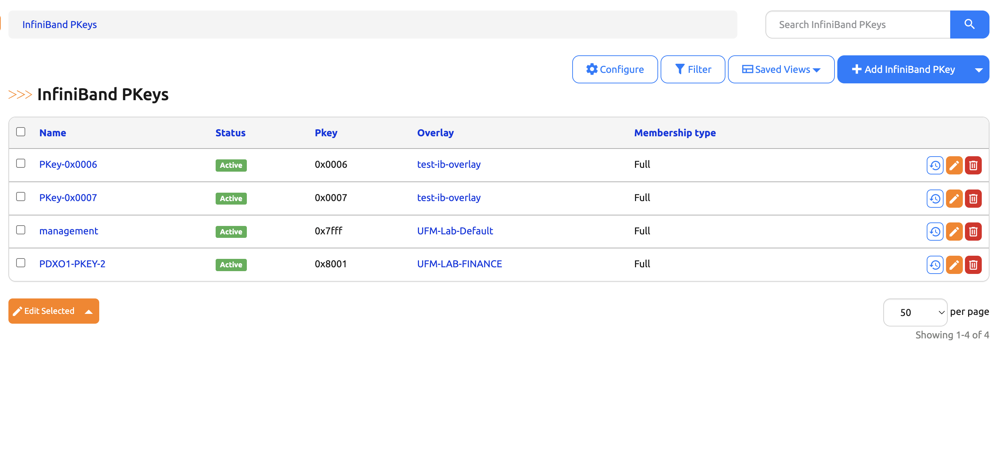

# InfiniBand PKey Management

The InfiniBand PKey model tracks Partition Keys for IB fabric isolation.



## Model Fields

| Field | Type | Required | Description |
|-------|------|----------|-------------|
| PKey | String | Yes | Partition Key value (e.g., `0x8001`) |
| Name | String | Yes | Descriptive name |
| Membership Type | Choice | Yes | `full` or `limited` — default for overlay assignments |
| Status | Status | Yes | Active, Reserved, etc. |
| Overlay | ForeignKey | No | Associated overlay (must have isolation type **IB PKey**) |
| Tenant | ForeignKey | No | Owning tenant |
| QoS Config | JSON | No | Optional QoS settings (e.g., service level, MTU) |

!!! note "Overlay Constraint"
    InfiniBand PKeys can only be associated with Overlays that have isolation type **IB PKey**. The overlay dropdown in the UI is filtered to only show compatible overlays.

## Membership Types

- **Full** — Can communicate with all members of the partition
- **Limited** — Can only communicate with full members

## Interface Membership

IB PKey overlays track interface membership via Overlay Assignments. Each assigned interface requires:

- **GUID** — The InfiniBand port's globally unique identifier (e.g., `0x0002c9030012abcd`)
- **Membership Type** — Optional per-interface override (`full` or `limited`); defaults to the PKey's membership type if omitted

This data enables integration with UFM (Unified Fabric Manager) for PKey assignment to physical ports.

## Creating PKeys

**Web UI:** Navigate to **Multi-Tenancy > InfiniBand PKeys > Add**

**REST API:**

```bash
curl -X POST "https://nautobot.example.com/api/plugins/overlays/pkeys/" \
  -H "Authorization: Token $TOKEN" \
  -H "Content-Type: application/json" \
  -d '{
    "pkey": "0x8001",
    "name": "HPC-Compute",
    "membership_type": "full",
    "qos_config": {"service_level": 0, "mtu": 4096},
    "status": {"name": "Active"}
  }'
```
