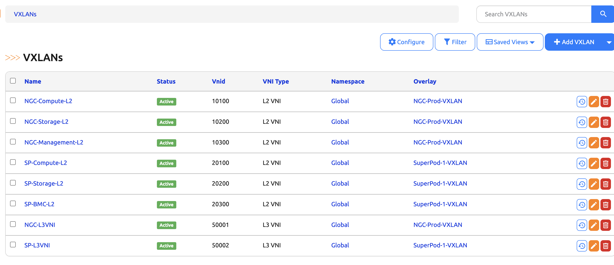

# VXLAN Management

The VXLAN model tracks VXLAN Network Identifiers (VNIs).



## Model Fields

| Field | Type | Required | Description |
|-------|------|----------|-------------|
| VNID | Integer | Yes | VNI value (1-16777215) |
| Name | String | Yes | Descriptive name |
| VNI Type | Choice | Yes | `l2` (L2 VNI) or `l3` (L3 VNI) |
| Namespace | ForeignKey | Yes | Scopes VNI uniqueness |
| Status | Status | Yes | Active, Reserved, etc. |
| Overlay | ForeignKey | No | Associated overlay (VXLAN/EVPN type only) |
| VLAN | ForeignKey | No | L2 VLAN mapping |
| VRF | ForeignKey | No | L3 VRF mapping |
| Import route targets | ManyToMany | No | BGP EVPN import RTs for this VNI (see [Route targets](#route-targets-bgp-evpn)) |
| Export route targets | ManyToMany | No | BGP EVPN export RTs for this VNI (see [Route targets](#route-targets-bgp-evpn)) |
| L3 VLAN ID | Integer | No | Local VLAN for L3 VNI SVI (1-4094) |
| Tenant | ForeignKey | No | Owning tenant |

!!! note "Overlay Constraint"
    VXLANs can only be associated with Overlays that have isolation type **VXLAN/EVPN**. The overlay dropdown in the UI is filtered to only show compatible overlays.

## VNI Types

- **L2 VNI** - Extends a VLAN across VXLAN fabric
- **L3 VNI** - Provides inter-VLAN routing via VRF

## Route targets (BGP EVPN)

Route targets on a VXLAN use the same IPAM Route Target objects as Nautobot VRFs.

- **L2 VNI** -- EVPN import/export RTs for the MAC-VRF are set on the VXLAN.
- **L3 VNI** -- RD and route targets for the tenant L3 VPN stay on the linked VRF. The VXLAN detail view shows both VNI-level and VRF-level RTs for comparison.

### Per-overlay route targets

When multiple leaf groups share a VNI but need different RTs, assign the VXLAN to each overlay via an **Overlay Assignment** and set per-assignment RTs.

The VXLAN's own `import_targets` / `export_targets` act as defaults. Per-overlay assignments override them.

1. Create a VXLAN with optional default RTs.
2. Navigate to an Overlay and click **Assign VXLAN**.
3. Choose the VXLAN and set the per-overlay import/export route targets.

**REST API:**

```bash
curl -X POST "https://nautobot.example.com/api/plugins/overlays/overlay-assignments/" \
  -H "Authorization: Token $TOKEN" \
  -H "Content-Type: application/json" \
  -d '{
    "overlay": "<overlay-uuid>",
    "assigned_object_type": "nautobot_app_overlays.vxlan",
    "assigned_object_id": "<vxlan-uuid>",
    "import_targets": ["<route-target-uuid>"],
    "export_targets": ["<route-target-uuid>"],
    "status": {"name": "Active"}
  }'
```

## Creating VXLANs

**Web UI:** Navigate to **Multi-Tenancy > VXLANs > Add**

**REST API:**

```bash
# L2 VNI
curl -X POST "https://nautobot.example.com/api/plugins/overlays/vxlans/" \
  -H "Authorization: Token $TOKEN" \
  -H "Content-Type: application/json" \
  -d '{
    "vnid": 10100,
    "name": "VLAN100-VNI",
    "vni_type": "l2",
    "namespace": {"name": "Global"},
    "vlan": {"vid": 100},
    "status": {"name": "Active"}
  }'

# L3 VNI
curl -X POST "https://nautobot.example.com/api/plugins/overlays/vxlans/" \
  -H "Authorization: Token $TOKEN" \
  -H "Content-Type: application/json" \
  -d '{
    "vnid": 50000,
    "name": "VRF-Prod-L3VNI",
    "vni_type": "l3",
    "namespace": {"name": "Global"},
    "vrf": {"name": "Production"},
    "l3_vlan_id": 3000,
    "status": {"name": "Active"}
  }'

# L2 VNI with import/export route targets
curl -X POST "https://nautobot.example.com/api/plugins/overlays/vxlans/" \
  -H "Authorization: Token $TOKEN" \
  -H "Content-Type: application/json" \
  -d '{
    "vnid": 10100,
    "name": "L2-segment-RTs",
    "vni_type": "l2",
    "namespace": {"name": "Global"},
    "import_targets": ["aaaaaaaa-aaaa-aaaa-aaaa-aaaaaaaaaaaa"],
    "export_targets": ["bbbbbbbb-bbbb-bbbb-bbbb-bbbbbbbbbbbb"],
    "status": {"name": "Active"}
  }'
```
