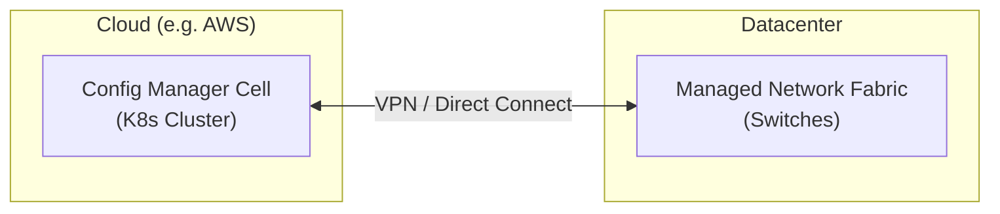
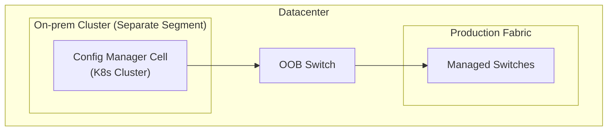
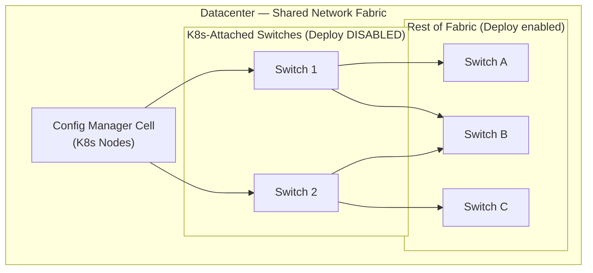

This guide describes the supported deployment models for hosting an NVIDIA Config Manager cell instance and the network topology requirements that apply to all of them.

## Deployment models

### Cloud hosted

Config Manager runs in a cloud environment (for example, AWS) that is network-adjacent to, but physically separate from, the datacenter fabric it manages.

**How it works:**

- A cell instance is deployed to a cloud Kubernetes deployment (e.g. EKS) ahead of hardware delivery for planning and pre-population of device data in Nautobot.
- Once on-prem hardware is available, Config Manager manages the site remotely over a VPN or direct-connect link.
  - The cloud connectivity **must not go through NAT**. Client IP preservation is critical to the provisioning process.
- DHCP/ZTP traffic reaches Config Manager via DHCP relay on the management network's core switches, with relay targets pointing to the cloud-hosted Config Manager addresses.

**Benefits:**

- Complete isolation — a misconfiguration on the managed fabric cannot disrupt access to Config Manager itself.
- Enables Day 0 planning and testing before physical hardware arrives.
- Provides a natural failover target: if the on-prem instance is unreachable, the cloud instance still holds the full dataset and can resume management.

### On-prem hosted (separate network segment)

Config Manager runs on a Kubernetes cluster hosted on dedicated On-prem infrastructure at the datacenter site. The On-prem deployment sits on a **separate network segment** from the production fabric being managed, connected through an OOB switch.

**How it works:**

- The On-prem network segment contains the infrastructure devices required to host the Config Manager Kubernetes cluster, connected to the production fabric through an OOB switch.
- Config Manager manages the production fabric across this segment boundary.
- The On-prem infrastructure devices exist as data in Nautobot but should not be managed by this Config Manager instance, to avoid self-isolation risk (see [Protecting management switches](#protecting-management-switches) below).

**Benefits:**

- Low-latency management of the on-prem fabric without depending on external connectivity.
- The separate network segment means production fabric changes cannot isolate Config Manager.

### On-prem hosted (shared network segment)

For deployments where a separate admin/OOB network segment is not available, Config Manager can be hosted directly on the same network it manages. This model is common for external customers who lack a dedicated On-prem deployment.

**How it works:**

- The Kubernetes cluster hosting Config Manager connects to the same switches that Config Manager manages.
- Switches directly attached to the Kubernetes cluster nodes **must have deploy functionality disabled** so that they are never included in batch configuration deployments.

**Risk:**

- A batch deploy that reconfigures the switches providing connectivity to the Config Manager cluster can cause self-isolation, cutting off access to Config Manager and the troubleshooting data it holds.

**Required safeguards:**

1. **Disable deploy on Kubernetes-attached switches.**

   Mark the switches directly connected to the Kubernetes cluster as deploy-disabled in Nautobot. This excludes them from batch deploy workflows, preventing accidental self-isolation. Configuration changes to these switches should be applied manually through a controlled change process.

1. **Identify and document the Kubernetes-attached switches.**

   Maintain a clear record of which switches provide connectivity to the Config Manager cluster so that operators know which devices require manual handling.

See [Protecting management switches](#protecting-management-switches) for more detail on these safeguards.

## Protecting management switches

In both On-prem hosted models, the switches that provide connectivity to the Config Manager cluster carry a heightened risk: if Config Manager breaks their configuration, the operator may lose access to Config Manager itself (and the data needed to diagnose the problem).

To eliminate this risk, take one of the following approaches for any switch on the path between Config Manager and the rest of the fabric:

- **Exclude them from Config Manager entirely.** Do not add the On-prem or Kubernetes-attached switches to Nautobot as Config Manager-managed devices. Manage them out of band through a separate process (e.g. manual NVUE, Ansible).
- **Add them to Nautobot but disable deploy.** The switches can be modeled in Nautobot for documentation and topology visibility, but with deploy disabled they will never be included in batch configuration workflows. Any changes to these switches are applied manually.

Either approach eliminates the self-isolation risk.

<Tip title="Federated Nautobot">
If you run a federated Nautobot deployment with multiple Config Manager instances, you can instead delegate these switches to a separate instance (for example, a cloud-hosted fallback), so that a local outage cannot block their administration.
</Tip>

See [Network Topology Requirements](../network-topology-requirements/index.mdx) for the provisioning order and DHCP relay chain that every deployment must satisfy, and [Firewall Ports](../firewall-ports/index.mdx) for the ports that must be permitted between the device network and Config Manager.
