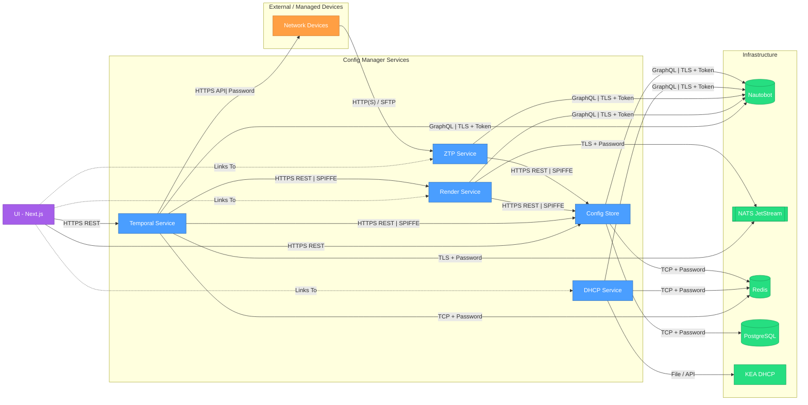

NVIDIA Config Manager uses different architectural patterns for initial network deployment (Day Zero) versus ongoing operations (Day Two).

## Day Zero: Network Bootstrap

The Day Zero architecture handles initial network provisioning for new deployments.

**Architecture Components:**

```text maxLines=0
┌─────────────────┐
│ Jinja2 Config   │
│   Templates     │ (Function/role-based definitions)
└────────┬────────┘
         │
         ├──────────────┐
         │              │
         ▼              ▼
    ┌────────┐     ┌────────┐
    │ Render │────▶│  ZTP   │────▶ Network Devices
    │Service │     │ Server │
    └────┬───┘     └────────┘
         │              │
         │              ▼
         │         ┌─────────┐
         │         │ Image   │
         │         │  Store  │
         │         └─────────┘
         ▼
    ┌─────────┐
    │  Data   │
    │  Store  │ (Hostnames, IP addresses, cables, etc.)
    └─────────┘
```

**Component Functions:**

- **Jinja2 Config Templates**: Function and role-based configuration definitions
- **Render Service**: Generates device-specific configurations from templates and data
- **ZTP Server**: Zero-Touch Provisioning server that delivers configurations to new devices
- **Nautobot**: Network source of truth (for example, hostnames, IP addresses, and cabling rules)
- **Config Store**: Central repository for rendered configurations
- **Image Store**: Storage for network operating system images

**Bootstrap Process:**

Anytime you make a change in Nautobot, the Render Service generates device configuration using templates and the Data Store. Then, when a new device joins the network, the configuration is ready to be delivered.

1. New device powers on and requests DHCP
1. DHCP directs device to ZTP Server
1. ZTP Server identifies device and retrieves appropriate OS image from Image Store
1. Device downloads and installs OS image
1. ZTP Server delivers configuration to device
1. Device applies configuration and joins network

## Day Two: Operational Changes

Day Two architecture handles ongoing network changes and operations through a workflow engine.

**Architecture Components:**

```text maxLines=0
┌─────────────────┐
│ Jinja2 Config   │
│   Templates     │
└────────┬────────┘
         │
         ├──────────────┐
         │              │
         ▼              ▼
    ┌────────┐     ┌──────────┐
    │ Render │────▶│ Workflow │────▶ Network Devices
    │Service │     │  Engine  │      (via workflows)
    └────┬───┘     └──────────┘
         │               ▲
         │               │ (Human approvals)
         │               │
         ▼               ▼
    ┌──────────┐     ┌───────┐
    │ Nautobot │     │ User  │
    └──────────┘     └───────┘
```

**Key Differences from Day Zero:**

- Changes pushed (without ZTP) directly to live devices with no impact to traffic
- Human approval workflows for SOC2 compliance
- Change tracking and audit capabilities

## Nautobot Interface Capabilities

Config Manager provides a web-based interface through a Nautobot plugin for fleet-wide device management.

### Instant Fleet-Wide Drift Audit

- Compare intended configuration against actual device state
- Identify configuration drift across entire fleet
- Filter devices by drift status

### Device Management

- View device details and status
- Track pending deployments

### Workflow Execution

The interface provides access to multiple workflow types. For more details, see the [Workflows](workflows.mdx) documentation.

### Status Indicators

Each device displays current status:

- **Total Config Manager Devices**: Complete device inventory count
- **All Pending Deployments**: Devices awaiting configuration changes
- **Pending Status**: Orange "Deploy" button shows deployment available
- **No Pending Deployment**: Device up to date

### Config Manager Config Details (per device)

The device detail view includes a Config Manager Config Details section showing:

| Field | Description |
| :---- | :---------- |
| Intended Config Version | Timestamp of intended configuration |
| Intended Config Updated By | User who last updated the configuration |
| Intended Config History | Link to intended configuration history in the Config Store UI |
| Last Config Backup | Timestamp of last backup |
| Backup History | Link to backup history |
| Render Enabled | ✅ Whether render service is active |
| ZTP Enabled | ✅ Whether ZTP provisioning is active |
| Deploy Enabled | ✅ Whether deployment is active |
| Backup Enabled | ✅ Whether backup workflows are active |
| Aggregate Managed | ❌ Whether managed by aggregate |

### Cable Validation

Config Manager provides automated cable validation by comparing intended network topology against live LLDP, MAC, and ARP data from devices.

The cable validation workflow:

- Bridges gaps between human-driven inventory data and live data sources
- Is deeply integrated, validating across network, DPU, and server boundaries
- Is performant, validating full site in under 60 seconds

For details on the cable validation workflow and report, see the [Cable Validation user's guide](../user-guides/cable-validation/index.mdx).

## Service Communication Diagram


