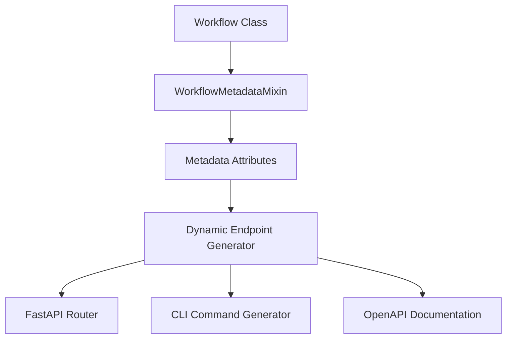

## Overview

The dynamic API endpoint generation system automatically creates FastAPI endpoints from workflow metadata. This creates a single source of truth for workflow definitions and provides excellent maintainability.

## System Components

### WorkflowMetadataMixin

The `WorkflowMetadataMixin` allows workflows to define their API metadata directly in the workflow class:

- `workflow_description`: Human-readable description
- `workflow_name`: Human-readable workflow name
- `workflow_input_class`: Pydantic input model
- `workflow_api_endpoint`: API endpoint path
- `workflow_namespace`: Workflow namespace

### Dynamic API Generator

The dynamic API generator:

- Automatically discovers workflows with complete metadata
- Generates FastAPI endpoint functions dynamically
- Handles proper routing, documentation, and parameter validation
- Provides consistent error handling and response formatting

### Workflow Examples

All workflows use the metadata system, including:

- **BackupWorkflow**: `/ngc/backup` - "Backup network device configuration to Config Store"
- **DeployWorkflow**: `/ngc/deploy` - "Deploy intended configuration to network device with approval workflow"
- **VpcCreationWorkflow**: `/ngc/vpc_creation` - "Create VPC with route distinguisher assignment and VRF provisioning"
- **VpcDeletionWorkflow**: `/ngc/vpc_deletion` - "Delete VPC and associated VRFs with validation checks"
- **ReprovisionWorkflow**: `/ngc/reprovision` - "Reprovision network device using ZTP and perform post-provision backup"
- **ConnectedHostMetadataWorkflow**: `/ngc/connected_host_metadata` - "Discover and analyze connected hosts through MAC table and LLDP neighbor data"
- **HelloWorld**: `/hello_world` - "Simple hello world workflow for testing and demonstration"
- **HelloWorldApproval**: `/hello_world_approval` - "Hello world workflow with approval step for testing staged workflows"

### Integrated Benefits

- CLI automatically discovers workflows and generates commands
- OpenAPI documentation is automatically generated
- Consistent parameter validation across all interfaces
- Single source of truth for workflow definitions

## Technical Implementation

### Workflow Definition with Metadata

```python
# Workflows define their metadata directly in the class
@workflow.defn
class BackupWorkflow(WorkflowMetadataMixin, StageMixin, DeviceMixin, ArchiveMixin):
    """Network device configuration backup workflow."""

    # Workflow metadata
    workflow_name = "Backup"
    workflow_description = "Backup network device configuration to Config Store"
    workflow_input_class = BackupInput
    workflow_api_endpoint = "/ngc/backup"
    workflow_namespace = "ngc"

    @workflow.run
    async def run(self, input_data: BackupInput) -> str:
        # Workflow implementation
        pass
```

### Automatic Endpoint Generation

```python
# In dynamic_endpoints.py - Automatic discovery and registration
def register_dynamic_endpoints(router: APIRouter) -> None:
    """Register all workflow endpoints dynamically."""
    for workflow_class in get_registered_workflows():
        if hasattr(workflow_class, 'has_complete_metadata') and workflow_class.has_complete_metadata():
            endpoint_path = workflow_class.get_workflow_api_endpoint()
            input_class = workflow_class.get_workflow_input_class()
            endpoint_func = create_workflow_endpoint(workflow_class, input_class, endpoint_path)
            router.add_api_route(
                endpoint_path,
                endpoint_func,
                methods=["POST"],
                response_model=WorkflowResponse,
                name=f"{workflow_class.__name__.lower()}_endpoint"
            )
```

## Key Benefits

### Single Source of Truth

- Workflow metadata is defined once in the workflow class
- API endpoints, CLI help, and documentation all derive from the same source
- Consistent information across all interfaces

### Automatic Discovery

- New workflows are automatically discovered and exposed using the API
- CLI automatically generates commands for new workflows
- No manual endpoint registration required

### Easy Maintenance

- Adding a new workflow requires only:
  1. Adding `WorkflowMetadataMixin` to the workflow class
  2. Setting the metadata attributes
  3. Adding to `REGISTERED_WORKFLOWS` list
- System automatically handles the rest

### Comprehensive Documentation

- Workflow descriptions appear in:
  - OpenAPI/Swagger documentation
  - CLI help text
  - Workflow discovery endpoints
- Consistent documentation across all interfaces

### Type Safety

- Pydantic input models ensure type safety
- FastAPI automatically generates request/response schemas
- CLI parameter validation matches API validation

## Architecture

### Workflow Discovery Flow



### Components

#### WorkflowMetadataMixin (`src/nv_config_manager/temporal/common/mixins/metadata.py`)

```python
class WorkflowMetadataMixin:
    """Mixin for defining workflow metadata."""

    workflow_name: str | None = None
    workflow_description: str | None = None
    workflow_input_class: type[BaseModel] | None = None
    workflow_api_endpoint: str | None = None
    workflow_namespace: str | None = None

    @classmethod
    def get_workflow_description(cls) -> str:
        """Get the workflow description."""
        return cls.workflow_description or cls.__doc__.strip().split('\n')[0]

    @classmethod
    def has_complete_metadata(cls) -> bool:
        """Check if the workflow has complete metadata defined."""
        return bool(cls.workflow_description and cls.workflow_input_class and cls.workflow_api_endpoint)
```

#### Dynamic Endpoint Generator (`src/nv_config_manager/temporal/api/dynamic_endpoints.py`)

```python
def create_workflow_endpoint(workflow_class: Type, input_class: Type[BaseModel], endpoint_path: str):
    """Create a FastAPI endpoint function for a workflow."""

    async def workflow_endpoint(body: BaseModel, request: Request) -> WorkflowResponse:
        """Execute the workflow with provided parameters."""
        if start_workflow is None:
            raise RuntimeError("start_workflow function not set.")

        # Auto-populate user fields from request auth data
        user = getattr(request.state, 'user', 'unknown')
        if hasattr(body, 'user') and not body.user:
            body.user = user
        if hasattr(body, 'user_domain') and not body.user_domain:
            body.user_domain = user.split("@")[1] if "@" in user else "nvidia.com"

        workflow_id = await start_workflow(request, workflow_class, body)
        return WorkflowResponse(id=workflow_id)

    # Set function metadata for FastAPI
    workflow_endpoint.__name__ = f"{workflow_class.__name__.lower()}_endpoint"
    workflow_endpoint.__doc__ = f"Execute the {workflow_class.__name__} workflow."
    workflow_endpoint.__annotations__ = {
        'body': input_class,
        'request': Request,
        'return': WorkflowResponse
    }

    return workflow_endpoint
```

#### Registration System

```python
def register_dynamic_endpoints(router: APIRouter) -> None:
    """Register all workflow endpoints dynamically."""
    workflows = get_registered_workflows()

    for workflow_class in workflows:
        workflow_class = cast(Type[WorkflowMetadataMixin], workflow_class)

        if workflow_class.has_complete_metadata():
            endpoint_path = workflow_class.get_workflow_api_endpoint()
            input_class = workflow_class.get_workflow_input_class()

            endpoint_func = create_workflow_endpoint(workflow_class, input_class, endpoint_path)

            router.add_api_route(
                endpoint_path,
                endpoint_func,
                methods=["POST"],
                response_model=WorkflowResponse,
                name=f"{workflow_class.__name__.lower()}_endpoint",
                summary=workflow_class.get_workflow_description()
            )
```

## Adding New Workflows

### Create Workflow with Metadata

```python
from nv_config_manager.temporal.common.mixins.metadata import WorkflowMetadataMixin

@workflow.defn
class MyNewWorkflow(WorkflowMetadataMixin, StageMixin):
    """My new workflow for doing amazing things."""

    # Workflow metadata
    workflow_description = "Perform amazing network operations with validation"
    workflow_input_class = MyNewWorkflowInput
    workflow_api_endpoint = "/ngc/my_new_workflow"
    workflow_namespace = "ngc"

    @workflow.run
    async def run(self, input_data: MyNewWorkflowInput) -> str:
        # Workflow implementation
        pass
```

### Create Input Model

```python
class MyNewWorkflowInput(BaseModel):
    """Input model for MyNewWorkflow."""

    device_id: str
    operation_type: str
    validate_before: bool = True
```

### Register Workflow

```python
# In src/nv_config_manager/temporal/ngc/workflows/__init__.py
REGISTERED_WORKFLOWS = [
    # ... existing workflows
    MyNewWorkflow,
]
```

### That's It

The workflow is now automatically:

- Available using the API at `/v1/workflow/ngc/my_new_workflow`
- Documented in OpenAPI/Swagger
- Available in CLI as `uv run workflow-cli my-new-workflow`
- Included in workflow discovery endpoints

## Workflow Discovery API

### List Workflow Executions

```bash
GET /v1/workflow/
```

Returns workflow execution summaries. Query parameters such as `workflow_type`,
`status`, `user`, `site`, `device_name`, `device_id`, `device_role`, and
`device_platform` filter the execution list.

### Get Registered Workflow Types

```bash
GET /v1/workflow/types
```

Returns the legacy list of registered workflow type names.

### Get Workflow Metadata

```bash
GET /v1/workflow/metadata
```

Returns registered workflow metadata and the RBAC roles needed by the UI:

```json
{
  "workflows": [
    {
      "name": "BackupWorkflow",
      "display_name": "Backup",
      "description": "Backup network device configuration to Config Store",
      "endpoint": "/ngc/backup",
      "namespace": "ngc",
      "cli_name": "backup",
      "input_class": "BackupInput",
      "read_roles": ["all"],
      "execute_roles": ["all"]
    }
  ]
}
```

## Testing

### Unit Tests

```python
def test_workflow_metadata():
    """Test that workflow has complete metadata."""
    assert BackupWorkflow.has_complete_metadata()
    assert BackupWorkflow.get_workflow_description() == "Backup network device configuration to Config Store"
    assert BackupWorkflow.get_workflow_api_endpoint() == "/ngc/backup"
    assert BackupWorkflow.get_workflow_input_class() == BackupInput

def test_dynamic_endpoint_generation():
    """Test that endpoints are generated correctly."""
    router = APIRouter()
    register_dynamic_endpoints(router)

    # Check that backup endpoint was registered
    backup_route = next((route for route in router.routes if route.path == "/ngc/backup"), None)
    assert backup_route is not None
    assert "POST" in backup_route.methods
```

### Integration Tests

```python
def test_backup_workflow_endpoint():
    """Test the dynamically generated backup endpoint."""
    response = client.post(
        "/v1/workflow/ngc/backup",
        json={"device_id": "test-device-id"},
        headers={"ssl-client-cert": test_cert}
    )
    assert response.status_code == 200
    assert "id" in response.json()
    assert "href" in response.json()
```

## Summary

The dynamic API system provides a clean, maintainable approach to workflow management. By defining metadata directly in workflow classes, the system automatically generates consistent APIs, CLI commands, and documentation. This approach scales well as new workflows are added and ensures consistency across all interfaces.
