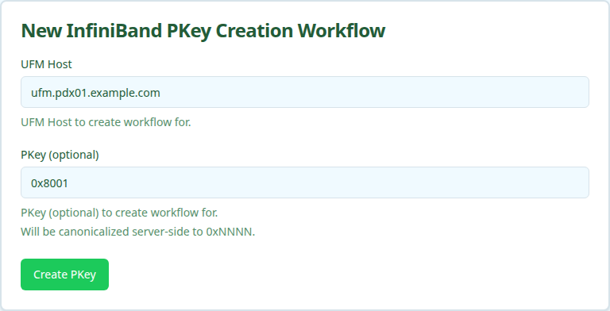

Provisions a new InfiniBand Partition Key (PKey) on UFM and records it in Nautobot. The PKey is the IB fabric's per-tenant isolation primitive. Members are attached separately through the [IB PKey Member Add](ib-pkey-member-add.mdx) workflow.

<Note>
The workflow is idempotent on the canonical PKey value. Re-running with the same PKey returns the existing record rather than allocating a duplicate.
</Note>

## User Interface

### Form Inputs

| Field | Description | Selection Type | Required |
| :---- | :---------- | :------------- | :------- |
| **UFM Host** | Nautobot device name of the UFM server that will own the PKey | Text input field | Yes |
| **PKey** | Specific partition key to allocate (`0x` + 1-4 hex digits). Leave blank to auto-assign in `[0x0001, 0x7FFE]` | Text input field | No |

## Workflow Execution

### Execution Stages

1. Resolve site from host via Nautobot
1. Validate PKey availability on UFM
1. Create PKey partition on UFM
1. Verify the PKey was propagated by the SM
1. Record the PKey in Nautobot
