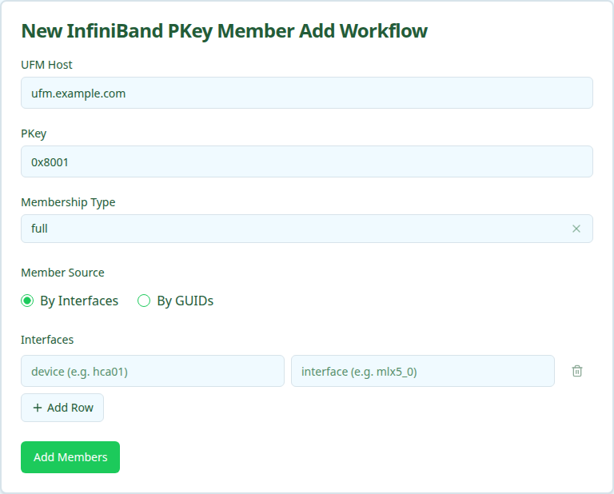

Adds device interface GUIDs to an existing InfiniBand PKey partition on UFM and records the matching `OverlayAssignment` rows in Nautobot. Members can be specified by Nautobot interface or by raw IB GUID.

For details on adding members to a Partition Key, see the [InfiniBand PKey Member Add](../../user-guides/ib-pkey-member-add/index.mdx) user guide.

<Note>
Members already attached to the PKey are not re-added. The workflow is additive — it never removes existing members.
</Note>

## User Interface

### Form Inputs

| Field | Description | Required |
| :---- | :---------- | :------- |
| **UFM Host** | Nautobot device name of the UFM server that owns the PKey | Yes |
| **PKey** | Partition key the members are joining (`0x` + 1-4 hex digits) | Yes |
| **Membership Type** | `full` (read/write) or `limited` (read-only). Defaults to `full`. | Yes |
| **Member Source** | `By Interfaces` for device/interface rows, `By GUIDs` for raw GUIDs | Yes |
| **Interfaces** | Device + interface name rows (one per member) | When **Member Source** is `By Interfaces` |
| **GUIDs** | One `0x` + 16 hex GUID per line, or comma-separated | When **Member Source** is `By GUIDs` |

## Workflow Execution

### Execution Stages

1. Resolve site, overlay, and canonical PKey from Nautobot
1. Resolve IB GUIDs for the submitted interfaces (or validate raw GUIDs)
1. Add GUIDs to the PKey partition on UFM
1. Verify the GUIDs are present in the PKey on UFM
1. Record `OverlayAssignment` entries in Nautobot
