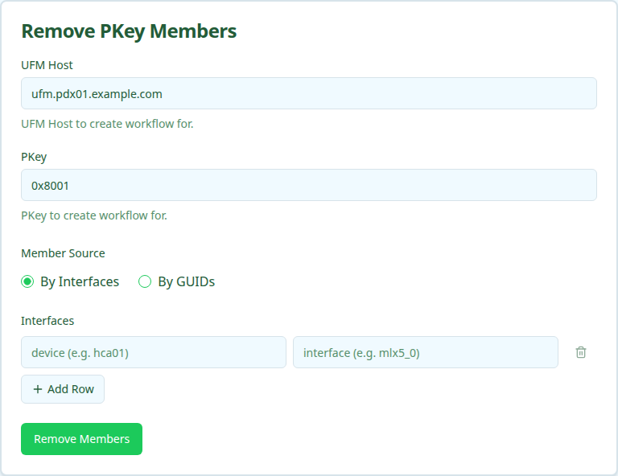

Removes specific device interface GUIDs from an existing InfiniBand PKey partition on UFM and deletes the matching `OverlayAssignment` rows in Nautobot. Other PKey members are left alone.

<Note>
Removing a GUID that is not currently in the PKey is a no-op on UFM. Interfaces with no existing `OverlayAssignment` are returned in `interface_ids_not_assigned` rather than failing the workflow.
</Note>

## User Interface

### Form Inputs

| Field | Description | Required |
| :---- | :---------- | :------- |
| **UFM Host** | Nautobot device name of the UFM server that owns the PKey | Yes |
| **PKey** | Partition key the members are being removed from | Yes |
| **Member Source** | `By Interfaces` or `By GUIDs` | Yes |
| **Interfaces** | Device + interface rows for the members to remove | When **Member Source** is `By Interfaces` |
| **GUIDs** | One `0x` + 16 hex GUID per line, or comma-separated | When **Member Source** is `By GUIDs` |

## Workflow Execution

### Execution Stages

1. Resolve site, overlay, and canonical PKey from Nautobot
1. Resolve IB GUIDs for the submitted interfaces (or validate raw GUIDs)
1. Remove GUIDs from the PKey partition on UFM
1. Verify the GUIDs are no longer present in the PKey on UFM
1. Delete the matching `OverlayAssignment` records in Nautobot
