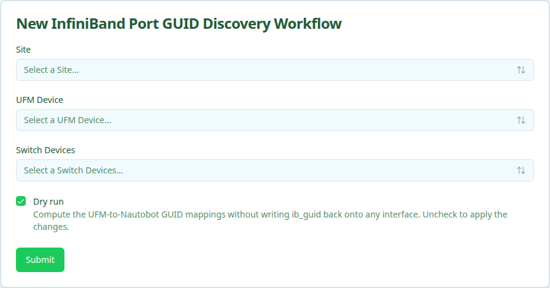

Discovers InfiniBand port GUIDs from UFM and syncs them onto the matching Nautobot interfaces (`custom_fields.ib_guid`). GUIDs are written only onto compute-side interfaces; the selected switches anchor the topology and are never modified. Compute interfaces are resolved from Nautobot's cable topology, not from UFM node descriptions.

For step-by-step instructions, see the [InfiniBand Port GUID Discovery](../../user-guides/ib-port-guid-discovery/index.mdx) user guide.

<Note>
The workflow is dry-run by default. A dry run computes the GUID-to-interface mappings without writing anything. Clear the Dry run option to apply them.
</Note>

## User Interface

### Form Inputs

| Field | Description | Required |
| :---- | :---------- | :------- |
| **Site** | Site that scopes the device dropdowns | Yes |
| **UFM Device** | UFM appliance to read port GUIDs from. Lists devices with role `UFM` in the selected site. | Yes |
| **Switch Devices** | InfiniBand switches that anchor the topology; GUIDs land on the compute interfaces cabled to them | Yes |
| **Dry run** | Compute mappings without writing `ib_guid`. Enabled by default. | No |

## Workflow Execution

### Execution Stages

1. Resolve the UFM hostname and site from Nautobot
1. Fetch UFM ports and Nautobot cable topology, then compute GUID-to-compute-interface mappings (switch-owned ports and inter-switch links are dropped)
1. Sync `ib_guid` onto each resolved compute interface (skipped on dry run)
