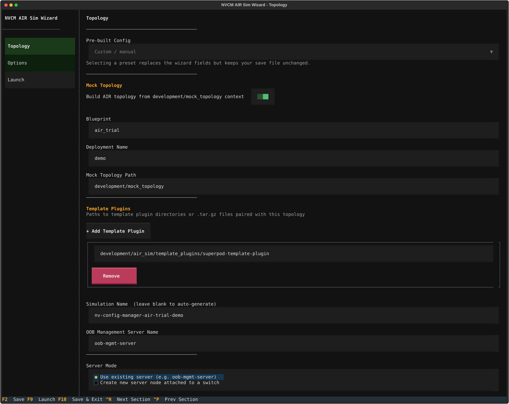
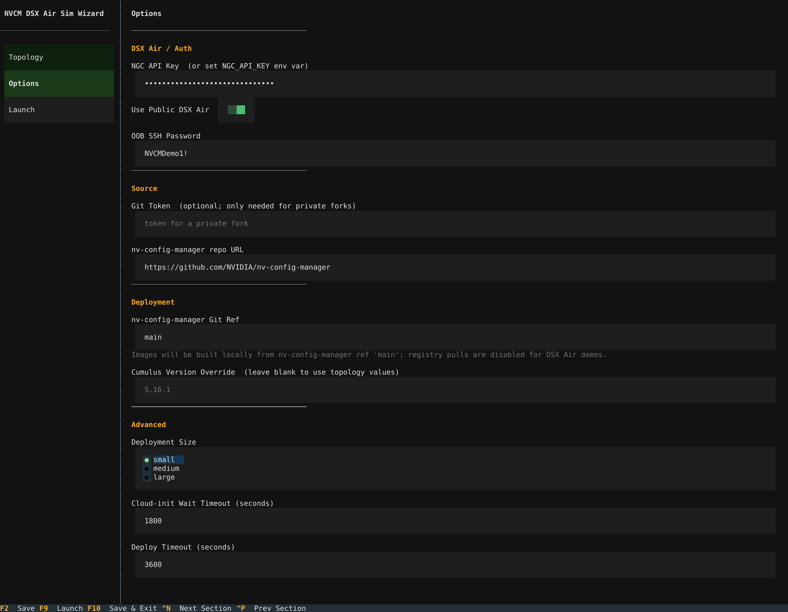
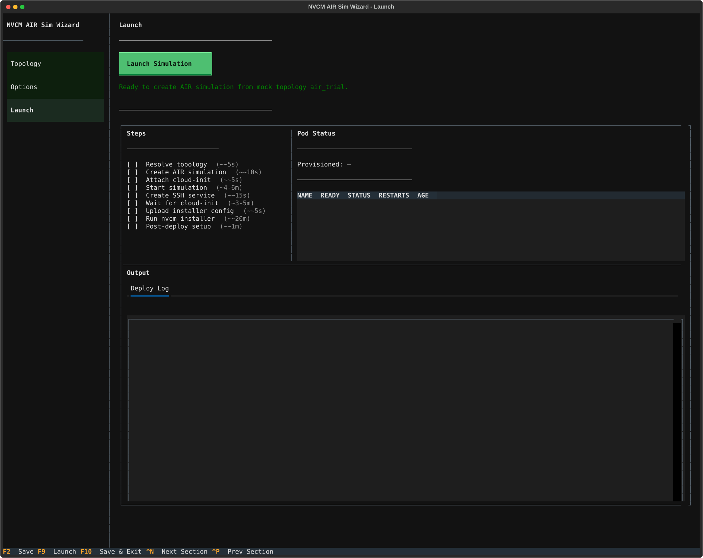
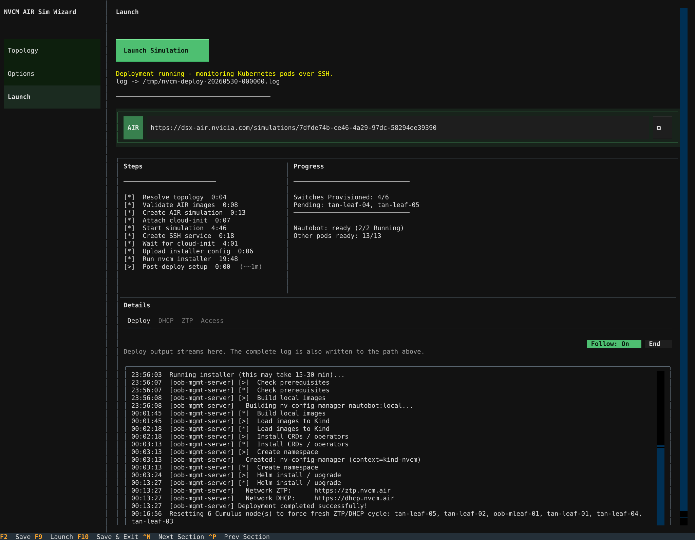
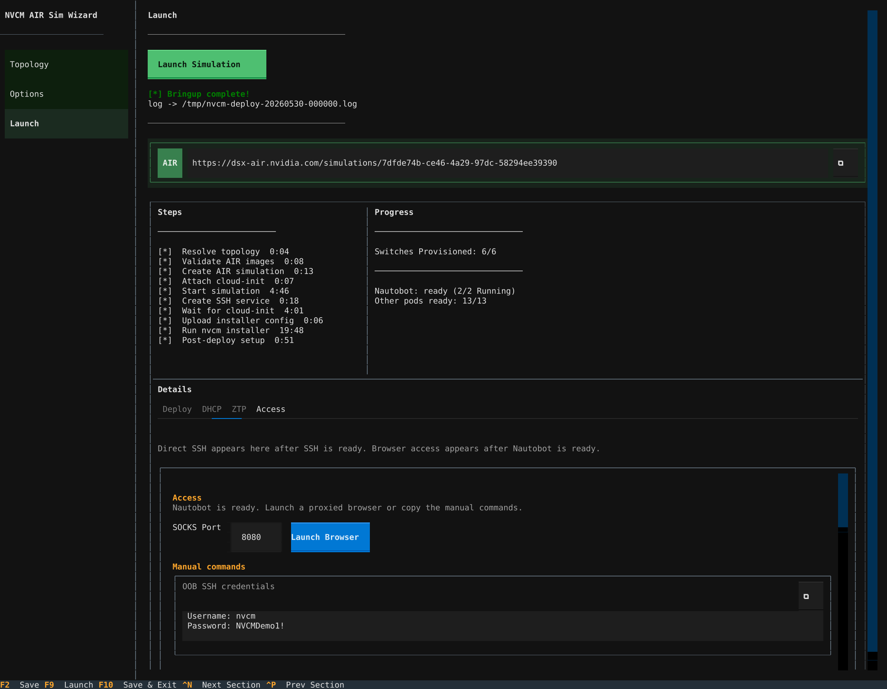

The Config Manager AIR simulation guide brings up a live NVIDIA DSX Air simulation, installs Config Manager inside the simulation, loads a demo Nautobot topology, and provisions virtual Cumulus Linux switches through DHCP and ZTP. Use it when you want to validate real device-facing workflows without touching a physical lab.

This is different from the [Local Development Quick Start](../../getting-started/local-development-quick-start.mdx). The local quick start is render-only. The AIR simulation runs Cumulus Linux switch nodes and exercises Config Manager against those nodes over the simulated management network.

<Note>
Most Config Manager workflows that operate on the demo Ethernet Cumulus switches can be exercised in AIR. InfiniBand and NVLink workflows are not included because AIR does not currently simulate those fabrics for this demo. Switch OS Upgrade is also excluded because the ONIE install path does not work in AIR.
</Note>

## Prerequisites

Before running the Config Manager AIR simulation, review the public NVIDIA DSX Air documentation:

- [NVIDIA DSX Air Account Setup](https://docs.nvidia.com/networking-ethernet-software/nvidia-air-v2/Account-Setup/) - NGC account, organization selection, free trial, and Air roles.
- [NVIDIA DSX Air Quick Start](https://docs.nvidia.com/networking-ethernet-software/guides/nvidia-air/Quick-Start/) - simulation navigation, services, node consoles, SSH keys, and API authentication.

You also need:

- Python 3.11+ and `uv`.
- An NGC API key for AIR API authentication. You can paste it into the TUI or set `NGC_API_KEY` in your shell.
- Enough DSX Air capacity for the selected demo. The AIR free trial preset is resource-capped for public trial accounts.
- A workstation browser that can run through a SOCKS proxy. Chromium-family browsers are easiest because the TUI prints ready-to-run commands.

## Start the TUI

From the Config Manager repository:

```bash
cd installer
uv sync
uv run nvcm-installer air-sim init --config nvcm-air-sim.yaml
```

The TUI writes `nvcm-air-sim.yaml`. Treat the file as sensitive if it contains your NGC API key.

You can also run a saved simulation config headlessly:

```bash
cd installer
uv run nvcm-installer air-sim deploy --config nvcm-air-sim.yaml
```

## TUI Walkthrough

The AIR simulation TUI has three sections: Topology, Options, and Launch.

### Topology

Use the **Pre-built Config** selector for the built-in demos. For most users, start with **AIR free trial demo**. It creates one OOB management leaf and five `TAN-HLEAF` Cumulus switches, which is enough to exercise ZTP, backup, deploy, multi-deploy, reprovision, and validation workflows.

The preset enables **Mock Topology**, points the loader at `development/mock_topology`, and configures the template plugin paired with the demo topology. Keep the paired template plugin in place; the prebuilt demos require those templates to render valid device configuration.



Important fields:

| Field | Description |
| :---- | :---------- |
| **Pre-built Config** | Loads the AIR trial or SuperPOD demo values into the TUI. |
| **Mock Topology** | Builds AIR topology and Nautobot data from `development/mock_topology` instead of a hand-authored AIR topology YAML. |
| **Blueprint** | Mock topology blueprint, such as `air_trial`. |
| **Deployment Name** | Suffix used by the mock topology job. For the AIR trial preset, this is `demo`. |
| **Template Plugins** | Template plugin directories or archives paired with the selected topology. |
| **Simulation Name** | Name shown in DSX Air. Leave blank to auto-generate. |
| **OOB Management Server Name** | Existing AIR server node that receives Config Manager, usually `oob-mgmt-server`. |

### Options

Use **Options** to set AIR authentication, deployment behavior, and advanced timing values.



Recommended public AIR values:

| Field | Recommended value |
| :---- | :---------------- |
| **NGC API Key** | Your AIR-capable NGC API key, or leave blank if `NGC_API_KEY` is set. |
| **Use Public Air** | On. |
| **Auto-configure server on boot** | On. The TUI attaches cloud-init so the server prepares itself after boot. |
| **Git Token** | Blank for the public `NVIDIA/nv-config-manager` repository. |
| **nv-config-manager Git Ref** | `main`, unless you are testing a branch that contains unreleased AIR sim code. |
| **Deployment Size** | `small` for the public AIR trial demo. |
| **Run nv-config-manager-installer deploy after setup** | On. |

### Launch

The **Launch** screen creates the simulation, starts it, waits for SSH, deploys Config Manager, runs post-deploy Nautobot jobs, monitors pods, and follows DHCP/ZTP logs.



Click **Launch Simulation** and leave the TUI open. The launch can take a while because it boots the AIR nodes, builds and loads local images, installs Config Manager, and lets the switches provision.

During launch:

- **Steps** shows high-level orchestration progress.
- **Pod Status** polls Kubernetes pods inside the AIR server over SSH.
- **Deploy Log** streams installer output.
- **DHCP** and **ZTP** tabs appear when service monitoring starts.
- **SSH** appears once the AIR worker exposes the management server.



When bringup completes, the **Access** tab shows commands for reaching the simulation.



## Access the Simulation

Config Manager runs inside the `oob-mgmt-server` node in AIR. The TUI creates an AIR SSH service to that server and prints copyable commands.

For Linux and macOS:

1. Copy the **Linux / macOS - SOCKS tunnel** command from the Access tab and run it in a terminal.
1. Copy the **Linux / macOS - browser** command, or manually launch a browser with `socks5://localhost:8080`.
1. Open the Config Manager and Nautobot URLs through that browser session.

Common service URLs inside the SOCKS-proxied browser are:

| Service | URL |
| :------ | :-- |
| Config Manager UI | `https://nvcm.air` |
| Nautobot | `https://nautobot.nvcm.air` |
| Workflow API | `https://workflow.nvcm.air` |
| Config Store API | `https://config-store.nvcm.air` |
| Render API | `https://render.nvcm.air` |
| DHCP API | `https://dhcp.nvcm.air` |
| ZTP API | `https://ztp.nvcm.air` |

The demo disables SSO. Nautobot credentials are `demo` / `demo`. Config Manager workflow RBAC is opened for the demo so the workflow forms can be exercised without identity-provider setup.

<Note>
DNS resolution for `*.nvcm.air` must go through the SOCKS tunnel. If a browser resolves names locally before using the proxy, the URLs will fail even though the services are healthy.
</Note>

You can also SSH directly to the AIR server with the SSH command shown at the top of the Launch screen. This is useful for `kubectl` checks, pod logs, and low-level troubleshooting.

## What to Check After Bringup

After launch completes:

1. Open Nautobot and confirm the demo site, devices, interfaces, IP addresses, cables, roles, platforms, and config contexts exist.
1. Open Config Manager and confirm workflow forms are available.
1. Open Config Store and confirm intended configs exist for `tan-leaf-01` through `tan-leaf-05`.
1. In Nautobot, confirm the TAN leaf devices have status **Provisioned** after ZTP completes.
1. In the TUI, use the **DHCP** and **ZTP** tabs to inspect service activity if a device is still provisioning.

## Workflow Support

The AIR demo is intended for Ethernet and Cumulus Linux workflows. Useful workflows to try include:

- Configuration Backup
- Configuration Deploy
- Batch Deploy
- Multi-Device Deploy
- Tenant Deploy, if you scope it to demo devices with tenant data
- Cable Validation
- Hardware Validation
- Device Password Rotation
- Site Password Rotation
- Device Reprovision
- Workflow lifecycle actions such as approve, reject, retry, and terminate

Do not use the AIR demo for:

| Workflow family | Why it is excluded |
| :-------------- | :----------------- |
| InfiniBand workflows | AIR does not simulate the InfiniBand fabric for this demo. |
| NVLink switch workflows | AIR does not simulate NVLink switches for this demo. |
| Switch OS Upgrade | AIR cannot complete the ONIE install path used by the OS upgrade workflow. |

## Try Multi-Deploy

Multi-Deploy is a good first Day-2 workflow because the AIR trial demo has five `TAN-HLEAF` switches that should receive the same diff.

The example below adds a DNS server to the site config context. The render service picks up the Nautobot change, produces new intended configs for the TAN leaf devices, and Multi-Deploy groups the identical diffs for approval.

### Edit the DNS config context

1. Open `https://nautobot.nvcm.air`.
1. Log in as `demo` / `demo`.
1. Navigate to **Extensibility > Config Contexts**.
1. Open `air-trial-network-management-services - demo`.
1. Edit the **Data** field.
1. Add a DNS block. If the context already has a `dns` block, append one server to its `ipv4` list.

Example data with a demo DNS server:

```json
{
  "ztp": {
    "ipv4": [
      "172.18.255.201"
    ]
  },
  "dhcp": {
    "nvcm": {
      "ipv4": [
        "172.18.255.202"
      ]
    }
  },
  "management_prefixes": {
    "ipv4": [
      "172.18.0.0/16"
    ]
  },
  "provisioning_servers": {
    "ipv4": [
      "10.120.0.0"
    ]
  },
  "dns": {
    "ipv4": [
      "192.0.2.53"
    ]
  }
}
```

1. Save the config context.
1. Wait for render to regenerate intended configs. If no intended config changes appear after a short wait, make a no-op edit to the context or call `POST /v1/render/all` from the Render API at `https://render.nvcm.air/docs`.

### Run Multi-Deploy

1. Open `https://nvcm.air`.
1. Click the **+** button and select **MultiDeployWorkflow**.
1. Set **Role** to `TAN-HLEAF`.
1. Set **Max Batch Size** to `5` so all demo TAN leaf devices can be approved together when they share one diff.
1. Submit the workflow.
1. When the parent reaches the batch execution stage, open the child Batch Deploy link.
1. Review the shared diff. It should show the DNS server addition on each `tan-leaf-*` device.
1. Approve the batch.
1. Confirm the parent workflow completes and the child batch reports successful applies and backups.

For the full workflow behavior, see [Multi-Device Deploy](../multi-deploy/index.mdx) and [Batch Deploy](../batch-deploy/index.mdx).

## Try Reprovision

Reprovision shows the re-ZTP path for an already-running switch. It factory-resets the target Cumulus switch, waits for DHCP/ZTP to run again, and then triggers a fresh backup.

<Warning title="Device reset">
Reprovision intentionally takes the selected switch offline and wipes its running configuration. In the AIR demo this is safe, but the same workflow is disruptive in a real environment.
</Warning>

1. Open `https://nvcm.air`.
1. Click the **+** button and select **ReprovisionWorkflow**.
1. Select the AIR trial site, such as `TRIAL01 - demo`.
1. Select a TAN leaf device, such as `tan-leaf-01`.
1. Submit the workflow.
1. In the DSX Air UI, open the simulation topology.
1. Double-click the same switch node to open its console.
1. On the switch console, tail the Cumulus autoprovision log:

    ```bash
    sudo tail -f /var/log/autoprovision
    ```

    This lets you watch the switch-side ZTP process while Config Manager waits for the device to report provisioned.

1. In the Config Manager UI, watch the Reprovision workflow stages. The workflow completes after ZTP succeeds and the backup child workflow finishes.
1. In Nautobot, confirm the device status returns to **Provisioned**.

You can also watch the TUI **ZTP** tab or the ZTP service logs if the switch stalls. For the full production workflow details, see [Device Reprovision](../reprovision/index.mdx).

## Other Useful Exercises

After Multi-Deploy and Reprovision, try these workflows:

- **Configuration Backup** against one TAN leaf. Confirm the backup appears in Config Store.
- **Configuration Deploy** against one TAN leaf after a small Nautobot config context change. Use this before Multi-Deploy if you want to inspect the single-device approval path.
- **Cable Validation** for the AIR trial site. This checks LLDP-reported neighbors against the mock topology's Nautobot cabling.


## Cleanup

AIR simulations consume account resources while running. When you are done, stop or delete the simulation in the DSX Air UI. If you expect to resume later, use AIR checkpoints according to your account limits. If you only needed a short demo, delete the simulation to free capacity.

The TUI-created Config Manager deployment lives inside the AIR simulation. Deleting the simulation removes the demo Kubernetes cluster, Nautobot data, Config Store data, and generated switch state.
