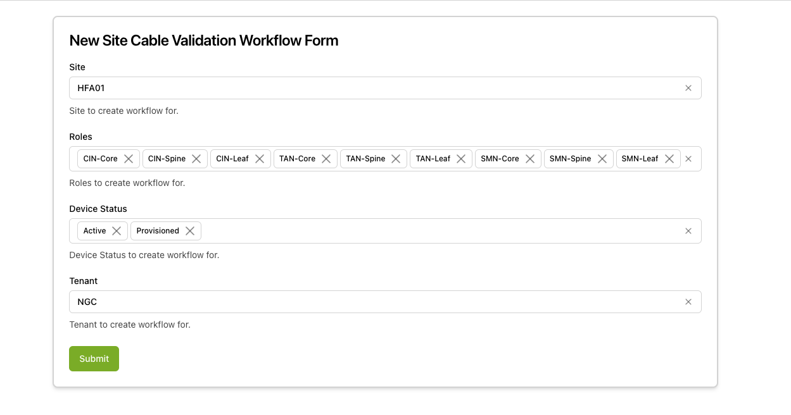
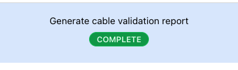
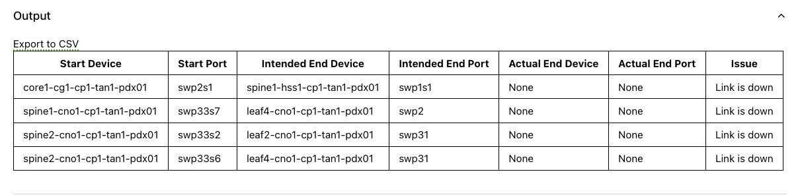

The Cable Validation workflows validate physical cabling against the intended topology in Nautobot. They compare what each switch reports over LLDP (and, where LLDP is unavailable, what its FDB and ARP tables show) against the cabling Nautobot says should be in place, and produce a per-interface report of every mismatch.

Two variants are available:

- **Site Cable Validation** — fans out across every in-scope device at a site. Used during new-site bringup and any time you want a full picture of cable health (before a maintenance window, after large-scale recabling, periodic auditing).
- **Device Cable Validation** — targets a single device. Used to re-validate after fixing a specific cabling, MAC, or hostname issue without re-running the full site.

The site workflow runs the device workflow as a child workflow per device, so the report format, the issue categories, and the underlying validation logic are identical between the two — only the scope differs.

Cable validation can detect:

- Cable swaps
- Unpowered servers
- Swapped racks
- Incorrect MAC addresses supplied by a partner
- Incorrect cable purchases

## Prerequisites

Before running cable validation, confirm the following are in place:

- **Devices have completed ZTP** and reached the `Provisioned` (or `Active`) status in Nautobot. Running validation against devices that are still provisioning or unreachable produces noisy failures. See [New Site Bringup](../new-site-deployment/index.mdx) for the bringup sequence.
- **Intended cabling is captured in Nautobot.** The workflow compares LLDP and FDB output against the cable list in Nautobot, so the Nautobot data must reflect the design. Connections that exist in Nautobot but should not be validated must carry the `cable-validation-ignore` interface tag.
- **Devices are running a supported platform** — Cumulus Linux, NVOS, or Arista EOS. Devices on other platforms are filtered out automatically.
- **Network reachability from Config Manager** to every in-scope device's management address, so the workflow can query LLDP neighbors and the MAC/ARP tables.

## Running site cable validation

Use this for site bringup or any time you need a full-site view.

1. Navigate to the Config Manager URL for your environment.

1. Click the **+** in the top right and select **SiteCableValidationWorkflow**.

    

    Fill in the form using the field reference below.

    | Field | Description | Required |
    | :---- | :---------- | :------- |
    | **Site** | The site to validate. | Yes |
    | **Roles** | Device roles to include (multi-select). On InfiniBand sites, exclude CIN devices — they are validated by a separate workflow. | Yes |
    | **Device Types** | Optional device-type filter. When set, only devices whose Nautobot device type IDs are in this list are included. | No |
    | **Device Status** | Device statuses to include (multi-select). Typically `Provisioned`, the state devices are in after ZTP completes. | Yes |
    | **Tenant** | Nautobot tenant for the run. | Yes |

1. Submit the form. A status page appears showing the three workflow stages. Progress for the per-device child workflows is reported incrementally; once fewer than ten devices remain, the page links directly to each remaining child workflow so you can drill in on stragglers. This may take a few minutes as the workflow reaches out to every device in scope.

1. When the workflow is finished, click **Generate Cable Validation report** on the left menu to view the report.

    

    

1. Address any issues, then re-run the workflow to confirm they are resolved.

## Running device cable validation

Use this to re-validate a single device after fixing an issue without re-running the full site.

1. Navigate to the Config Manager URL for your environment.
1. Click the **+** in the top right and select **DeviceCableValidationWorkflow**.
1. Fill in the form using the field reference below and submit.

| Field | Description | Required |
| :---- | :---------- | :------- |
| **Site** | The site of the target device. Drives the device list below. | Yes |
| **Tenant** | Optional Nautobot tenant filter to narrow the device list. | No |
| **Status** | Optional device-status filter to narrow the device list. | No |
| **Device** | The target device. The list is filtered by the selections above. | Yes |
| **Ignore No Neighbor** | Optional. If enabled, suppresses `Link is up, but no neighbor found` findings for this device run. Useful during partial bringup where some far-side neighbors are intentionally absent. | No |

A typical device run completes in well under a minute, dominated by the round-trip time to query LLDP and the FDB.

## Execution stages

### Site cable validation

The site workflow runs three stages. None require manual approval.

1. **`get_devices_to_validate` — Resolve the device list from Nautobot.**

    Calls Nautobot for all devices matching the site, role, status, tenant, and device-type filters, then drops anything not on a supported platform (Cumulus Linux, NVOS, Arista EOS). The resolved device list is rendered as a Markdown table on the stage page. If no devices match the filters, the remaining stages are marked Unreachable and the workflow returns immediately with an explanatory message.

1. **`validate_devices` — Run a device cable validation child per device.**

    For each device, the site workflow starts a device cable validation child workflow, cloning the parent's `User`, `ReadRoles`, and `ExecuteRoles` search attributes and attaching the per-device `DeviceID`. The stage waits for all children to complete, updating the page incrementally as each one finishes (`N/total completed`, success/failure counts, and a list of remaining devices once fewer than ten are left). A child that fails is recorded against `failed_devices` rather than stopping the stage, so a single unreachable switch does not block the rest of the report.

1. **`format_result` — Aggregate per-device results into the site report.**

    Combines every child's interface findings into the consolidated Markdown report, with the list of `failed_devices` preserved verbatim at the top so operators know which switches were skipped versus which were validated and clean. The report renders inline on the stage page and is also offered as a downloadable CSV for cases where the result set is too large to view in the UI.

### Device cable validation

The device workflow runs six stages. The three data-collection stages (`get_device_intended_neighbors`, `get_device_actual_neighbors`, `get_device_mac_table`) run in parallel once the hostname check has passed.

1. **`get_device_data` — Fetch the device record from Nautobot.**

    Loads the device by UUID and attaches device search attributes to the workflow for observability. When the workflow is invoked as a child of site cable validation, the parent passes the already-fetched record so this stage is effectively a no-op.

1. **`validate_device_hostname` — Confirm the device's running hostname matches Nautobot.**

    Logs into the device and reads its configured hostname, then compares it against the Nautobot name. A mismatch fails the workflow before any cabling work begins, since cabling validation against the wrong device would produce misleading findings.

1. **`get_device_intended_neighbors` — Read intended cabling from Nautobot.**

    Pulls the list of intended LLDP/MAC neighbors for every interface on the device from Nautobot, including any `cable-validation-ignore` tagging that should exclude an interface from the comparison.

1. **`get_device_actual_neighbors` — Read observed cabling from the device.**

    Queries the device for its LLDP neighbor table on every interface. This is the primary source of truth for what is physically connected.

1. **`get_device_mac_table` — Read the FDB and ARP table from the device.**

    Pulls the MAC table (FDB) and ARP table off the device. MAC and ARP entries are the fallback validator for links where LLDP is not available — most commonly IPMI/BMC connections to hosts. When LLDP is absent, the FDB MAC must match the MAC recorded in Nautobot.

1. **`validate_connections` — Compare intended vs actual and produce the report.**

    Joins the three data sources, classifies every interface mismatch (link down, wrong neighbor, no neighbor found, unexpected connection), decorates the findings with the stable `ID` hash used across runs, and formats the per-device Markdown report. This stage is not retryable — if validation logic raises, the run fails outright rather than masking a real bug behind a retry.

The workflow's final output is a `DeviceCableValidationResult` whose `interfaces` field maps each invalid interface name to its findings.

## Interpreting the report

### Actual vs. Intended

The results in the report show the device/port pair being validated (Start Device/Port) and then what the intended connection should be (based on what is in Nautobot) compared to the actual observed connection on the device.

### Issue

The category of mismatch — see [Cable validation issues](#cable-validation-issues) below for the full catalog.

### Troubleshooting Info

An optional column containing any additional info the device provides about this link that may help operators diagnose the issue. The information depends entirely on the device being validated, but can often be helpful — for example, indicating that there is no cable or optic plugged into a port, or that there is a cable but no light. Consult the device documentation for further help on these messages.

### ID Field

A hash of certain columns of the report that persists across multiple reports. This helps track issues being fixed across runs since the ID remains the same for every (start device, start port, end device, end port) group.

### CSV Report

A link to download a CSV report is included on the result page. If the result set is too large to display in the UI, the CSV will still contain the full set of results.

## Cable validation issues

The possible validation failures are:

**`Link is down`**

A link that is expected to be present and up is operationally down. Either a bad cable/optic, or one end of the link is disabled.

**`Incorrect cabling, actual should match intended`**

The cabling modeled in Nautobot does not match what was found on the network. This can be due to:

- **LLDP data** — the physical cabling does not match what is modeled in Nautobot.
- **MAC address** — the MAC seen on the switch FDB does not match the expected MAC in Nautobot. Either the MAC in Nautobot is wrong, or the physical cabling is wrong. This is used when LLDP is not available, usually for IPMI/BMC connections.

**`Link is up, but no neighbor found`**

A link is present but no LLDP neighbor or MAC address was found, so the link could not be validated. Retrying the validation may resolve the issue. If it does not, check the status of the devices on either end to see why they are not operating properly. This error may also occur when a cable mismatch leads to a low-light condition.

**`Unexpected connection found`**

A neighbor was found that is not modeled in Nautobot. This could mean Nautobot is out of date, or that there are connections not in scope for Config Manager validation (commonly custom cabling for the site or connections to non-Nautobot-managed devices).

If there are connections in Nautobot that should be present but do not need to be validated, add the `cable-validation-ignore` tag to those interfaces and re-run the cable validation workflow to get a clean report.

## Common issues and troubleshooting

**One or more devices are listed as failed.**

A failed device means the per-device child workflow itself errored — most often because the device is unreachable over its management IP or its hostname does not match Nautobot. The device's findings are excluded from the report; fix the underlying issue and either re-run the site workflow or run a targeted device cable validation against just that device. The results page lists unreachable devices separately and excludes their results from the report.

**Hostname validation failed.**

The hostname configured on the device does not match Nautobot. Either the device was renamed in Nautobot without re-applying configuration, or you are running validation against the wrong device. Reconcile the names — typically by re-rendering and re-applying the device's configuration — and re-run.

**Stage `get_device_actual_neighbors` or `get_device_mac_table` failed.**

The device is unreachable, the management credentials are wrong, or the device is on an unsupported platform. Confirm the device is reachable on its management IP, that ZTP has completed, and that the platform field in Nautobot is set correctly. If the device was just reprovisioned, give LLDP a minute or two to populate before retrying.

**The report shows duplicate findings for the same link.**

Validation runs from both ends of a link when possible. Some deduplication is applied, but two devices may still report different errors for the same cable. Treat them as a single physical issue and resolve once.

**Multiple runs report different MACs for the same port.**

Unstable FDBs usually indicate a misbehaving device on one end of the link — investigate the neighboring switch or host rather than retrying validation.

**Server links are flapping between runs.**

Servers can churn LLDP/MAC state if they are stuck in a PXE boot loop on a partially provisioned site. Tag the leaf-side interfaces with `cable-validation-ignore` until the server side is provisioned, then remove the tag. On InfiniBand sites, server links are out of scope here — they are validated by a separate workflow.

**`Link is up, but no neighbor found` on multiple links.**

LLDP and the FDB were both empty for those interfaces. Retry the workflow first — LLDP can briefly miss neighbors right after a port flap. If the issue persists, check the neighbor on the far side of each link; an unpowered or misconfigured neighbor is the most common cause. Setting `Ignore No Neighbor` to true on the device workflow will hide these from the report, which is appropriate during a partial bringup but should not be the default.

**Validation found unexpected connections that are legitimately out of scope.**

For connections that exist in Nautobot but should not be validated (custom site cabling, non-Nautobot-managed neighbors), add the `cable-validation-ignore` tag to those interfaces and re-run for a clean report.

## Related guides

- [New Site Bringup](../new-site-deployment/index.mdx) — bringup procedure that runs site cable validation as part of site handoff.
- [Connected Host Metadata](../connected-host-metadata/index.mdx) — discover what is connected to a switch via LLDP + FDB without doing a validation pass.
- [Hardware Validation](../hardware-validation/index.mdx) — sibling site-wide validation for hardware health.
- [Network Topology Requirements](../../network-topology-requirements/index.mdx) — the topology and cabling constraints the validation enforces against.
