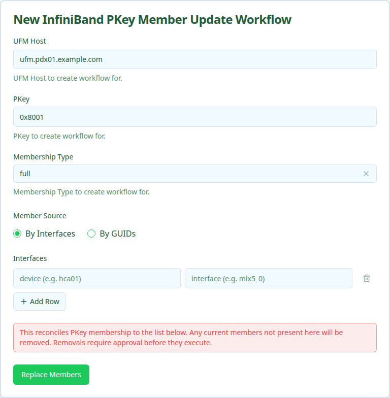

The InfiniBand PKey Member Update workflow reconciles a PKey's membership to a declarative list of interfaces or GUIDs. Members already attached are left alone, missing ones are added, and members not in the submitted list are removed. The UI labels this as "Replace PKey Membership" — the submitted list is treated as the desired complete state.

Use this when you want the PKey to match an exact set of members. If you only want to add or only want to remove, prefer [IB PKey Member Add](../ib-pkey-member-add/index.mdx) or [IB PKey Member Delete](../ib-pkey-member-delete/index.mdx).

<Warning title="Removals require approval">
When the computed diff contains any removals, the workflow pauses at the `validate_diff` stage and waits for approval before touching Nautobot or UFM. Additions-only runs auto-approve.
</Warning>

## Prerequisites

Before running, confirm:

- **PKey exists and the desired Overlay record is already created.** This workflow will not create Overlays. If the PKey has no Overlay linked in Nautobot, you have two options:
  - Run [IB PKey Member Add](../ib-pkey-member-add/index.mdx) once first — it lazily creates an Overlay at the PKey's Site when the PKey row is orphaned — then come back to Update to reconcile membership.
  - Create the Overlay manually in Nautobot under **Multi-Tenancy → Overlays → IB PKey** (click the `+` button), then return here.
- **Every interface in the desired list has an `ib_guid`** populated in Nautobot (By-Interfaces mode only).
- **You are ready to approve removals.** Any current member not in your submitted list will be removed.

## Running the workflow

1. Navigate to the Config Manager URL for your environment.
1. Click the **+** in the top right and select **IBPKeyMemberUpdateWorkflow**.
1. Fill in the form using the field reference below and submit.

| Field | Description | Required |
| :---- | :---------- | :------- |
| **UFM Host** | Nautobot device name of the UFM server that owns the PKey. | Yes |
| **PKey** | Partition key whose membership is being reconciled. | Yes |
| **Membership Type** | `full` or `limited`. Applied to any newly added members. | Yes |
| **Member Source** | `By Interfaces` or `By GUIDs`. | Yes |
| **Interfaces** / **GUIDs** | The desired complete member list. Any current member not in this list is queued for removal. | At least one row/GUID required |

After submission, a status page shows the execution stages.

## Execution stages

The workflow runs the following stages. `validate_diff` requires approval when removals are present.

1. **`resolve_context` — Resolve site, overlay, and canonical PKey from Nautobot.**

1. **`resolve_desired` — Resolve the submitted interfaces or GUIDs to canonical interface records.**

1. **`query_current` — Fetch current OverlayAssignments and compute the diff.**

   Reads the current `OverlayAssignment` set from Nautobot, intersects it with the desired set, and produces three lists: members to add, members to remove, and members unchanged. The stage output displays the diff with device/interface/GUID for each line.

1. **`validate_diff` — Approval gate.**

   If there are no removals, the workflow auto-approves and continues. If there are removals, the stage pauses in `PENDING_APPROVAL` and shows the full diff. An operator must approve or reject through the status page before the workflow proceeds. Rejection aborts cleanly without modifying Nautobot or UFM.

1. **`update_nautobot` — Sync OverlayAssignment records.**

   Creates new assignments and deletes removed ones in Nautobot.

1. **`update_ufm` — Apply the diff to UFM.**

   Removes the stale GUIDs from the PKey first, then adds the new GUIDs with the chosen membership type.

1. **`verify_ufm` — Verify final UFM state matches the desired set.**

   Re-reads the PKey membership from UFM and confirms it equals the resolved desired set, no more and no less.

## Approving (or rejecting) the diff

When the workflow pauses at `validate_diff`:

1. Open the workflow's status page.
1. Inspect the displayed diff (one line per add/remove with device, interface, and GUID).
1. Click **Approve** to apply the change, or **Reject** to abort.

If you reject, no changes are made. The downstream stages display as `UNREACHABLE` in the status page and the workflow records `verified: false` in its output.

## Verifying outcomes

After the workflow reports success, confirm:

- **All seven stages show green** (or `UNREACHABLE` for the post-rejection case).
- **UFM membership equals the submitted set.** No extra GUIDs, no missing GUIDs.
- **Nautobot OverlayAssignments equal the submitted set.** Removed members no longer appear under the Overlay.

## Common issues

**The diff looks wrong (too many adds or removes).**

The desired list is treated as the complete state. If you only meant to add three new members without disturbing the others, you must include the existing members in the submission too — or switch to the Add workflow instead.

**`validate_diff` is stuck in `PENDING_APPROVAL`.**

Someone needs to approve or reject through the workflow status page. There is no auto-timeout; the workflow waits indefinitely.

**`update_ufm` fails after `update_nautobot` succeeded.**

Nautobot and UFM are now temporarily out of sync. Re-run the workflow with the same desired list; the diff stage will recompute and only the still-pending changes will be reapplied.

## Related guides

- [IB PKey Creation](../ib-pkey-creation/index.mdx) — create the PKey.
- [IB PKey Member Add](../ib-pkey-member-add/index.mdx) — add members without touching existing ones.
- [IB PKey Member Delete](../ib-pkey-member-delete/index.mdx) — remove specific members without touching others.
