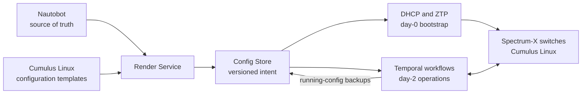

NVIDIA Config Manager supports the day-0 and day-2 management of Spectrum-X
Ethernet switches. A Spectrum-X switch running Cumulus Linux follows the same
provisioning, configuration, validation, and lifecycle workflows as any other
Cumulus Linux switch in Config Manager.

This page is the starting point for Spectrum-X switch support. It summarizes the
management path and links to the detailed operator guides.

## Where Config Manager fits

- **Nautobot is the source of truth.** Device identity, platform, role,
  interfaces, cabling, addressing, tenant data, and config contexts define the
  intended state.
- **The Render Service converts intent into device configuration.** It combines
  Nautobot data with the Cumulus Linux templates selected for the switch role
  and software version.
- **The Config Store versions intended and running configurations.** ZTP and
  deployment workflows consume the rendered intent; backup workflows write
  running-state snapshots for audit and drift detection.
- **DHCP and ZTP handle initial provisioning.** A factory-default switch obtains
  its boot information, installs the intended Cumulus Linux image when needed,
  downloads its rendered configuration, and reports its provisioning state.
- **Temporal workflows handle ongoing operations.** Config Manager reaches the
  switch over the management network to calculate and apply configuration
  changes, collect state, validate the fabric, rotate credentials, and manage
  the switch lifecycle.

The [System Architecture](../../overview/architecture.mdx) describes the component model. [Which Interface Should I Use?](../../getting-started/interfaces.mdx) explains the Config Manager UI, Nautobot UI, Temporal Web, and API boundaries.

## Spectrum-X switch workflows

The following workflows are the normal operational path for Spectrum-X
switches. The linked guides contain prerequisites, UI inputs, execution stages,
verification steps, and failure recovery.

| Phase | Task | Config Manager path |
| :---- | :--- | :------------------ |
| Model | Register switches, interfaces, cabling, addressing, roles, software targets, and config contexts. | [Nautobot Bootstrap](../../nautobot/index.mdx) and [DHCP Modeling in Nautobot](../../dhcp/nautobot-modeling.mdx) |
| Bootstrap | Provision factory-default switches with the intended Cumulus Linux image and configuration. | [New Site Bringup](../new-site-deployment/index.mdx) and [Network ZTP](../../network-ztp/index.mdx) |
| Validate | Compare observed LLDP, FDB, and ARP data with the modeled cabling. | [Cable Validation](../cable-validation/index.mdx) |
| Validate | Collect Cumulus platform, environmental, and inventory health across the site. | [Cumulus Hardware Validation](../hardware-validation/index.mdx) |
| Observe | Identify hosts connected to each switch interface. | [Connected Host Metadata](../connected-host-metadata/index.mdx) |
| Configure | Review and apply a rendered change to one switch, with human approval of the diff. | [Configuration Deploy](../configuration-deploy/index.mdx) |
| Configure | Apply a reviewed change across multiple switches with grouped, per-batch approval. | [Multi-Device Deploy](../multi-deploy/index.mdx) |
| Audit | Capture running configurations and compare them with intended state. | [Configuration Backup](../configuration-backup/index.mdx) and [Site Configuration Backup](../site-configuration-backup/index.mdx) |
| Recover | Factory-reset a reachable switch, re-run ZTP, and capture a fresh backup. | [Device Reprovision](../reprovision/index.mdx) |
| Maintain | Upgrade Cumulus Linux through the image install, reboot, ZTP, and post-upgrade validation cycle. | [Switch OS Upgrade](../switch-os-upgrade/index.mdx) |
| Secure | Rotate device credentials on one switch or across a site. | [Device Password Rotation](../device-password-rotation/index.mdx) and [Site Password Rotation](../site-password-rotation/index.mdx) |

### Typical operating sequences

For a new Spectrum-X fabric:

1. Load the approved topology and device intent into Nautobot.
1. Upload the required Cumulus Linux images to the ZTP service.
1. Follow [New Site Bringup](../new-site-deployment/index.mdx) to power on and
   provision the switches.
1. Run [Cable Validation](../cable-validation/index.mdx) and
   [Cumulus Hardware Validation](../hardware-validation/index.mdx) before
   handing the fabric to normal operations.

For a routine configuration change:

1. Change the source data in Nautobot or the applicable configuration template.
1. Confirm that the Render Service produced the expected intended configuration.
1. Run [Configuration Deploy](../configuration-deploy/index.mdx) for one switch
   or [Multi-Device Deploy](../multi-deploy/index.mdx) for a coordinated
   fabric-wide change.
1. Review the generated diff at the approval stage. After Config Manager applies the approved change, it captures a new running-configuration backup.

## Spectrum-X overlay lifecycle

Config Manager also includes workflows for switch-port tenant isolation on the
Spectrum-X underlay. These workflows manage the overlay, VRF, VXLAN, device, and
interface intent in Nautobot and can render and deploy the resulting
configuration.

| Workflow | Purpose | Device impact |
| :------- | :------ | :------------ |
| [Spectrum-X Overlay Creation](../vpc-creation/index.mdx) | Allocate the route distinguisher and create the Overlay, VRF, and L3 VXLAN objects in Nautobot. | No switch configuration is changed. |
| [Spectrum-X Overlay Assignment](../vpc-assignment/index.mdx) | Bind an existing overlay VRF to a device and selected interfaces in Nautobot. This is normally called by Spectrum-X Overlay Tenant Change; the standalone workflow is API-only. | No switch configuration is changed until a deploy runs. |
| [Spectrum-X Overlay Tenant Change](../vpc-tenant-change/index.mdx) | Orchestrate assignment, tenant-scoped rendering, and deployment to a switch. | Applies the validated tenant configuration to the target switch. |
| [Spectrum-X Overlay Deletion](../vpc-deletion/index.mdx) | Remove unused VRF, VXLAN, and Overlay metadata after assignments have been removed. | Deletes Nautobot intent; in-use VRFs are protected from deletion. |

The common operator path is:

1. Run **Spectrum-X Overlay Creation** once for the tenant overlay at the site.
1. Run **Spectrum-X Overlay Tenant Change** to assign the overlay to a switch and its
   ports, render the changed intent, and deploy it end to end.
1. Before deletion, remove the overlay from all interfaces and deploy the resulting configuration change. Then, run **Spectrum-X Overlay Deletion** to clean up the unused Nautobot objects.

These overlay workflows supplement the normal Spectrum-X switch
management path. They are not required for ZTP, general configuration
deployment, backup, validation, reprovisioning, software upgrades, or password
rotation.

## Management prerequisites

Before operating a Spectrum-X switch through Config Manager, confirm:

- The device is modeled in Nautobot with its Cumulus Linux platform, fabric
  role, serial number, management identity, interfaces, cabling, intended
  software, and required config contexts.
- Config Manager can reach the device management network and the required
  [firewall ports](../../firewall-ports/index.mdx) are open.
- Device credentials are available through the configured secrets backend.
- The correct Cumulus Linux image is available to the
  [ZTP service](../../network-ztp/upload-images.mdx).
- The Render Service has produced a current intended configuration in the
  Config Store before a deploy, backup, reprovision, or upgrade workflow runs.

For device-facing validation without physical hardware, use the
[DSX Air Simulation User Guide](../air-simulation/index.mdx), which provisions
simulated Cumulus Linux switches and supports the main Ethernet workflows.
